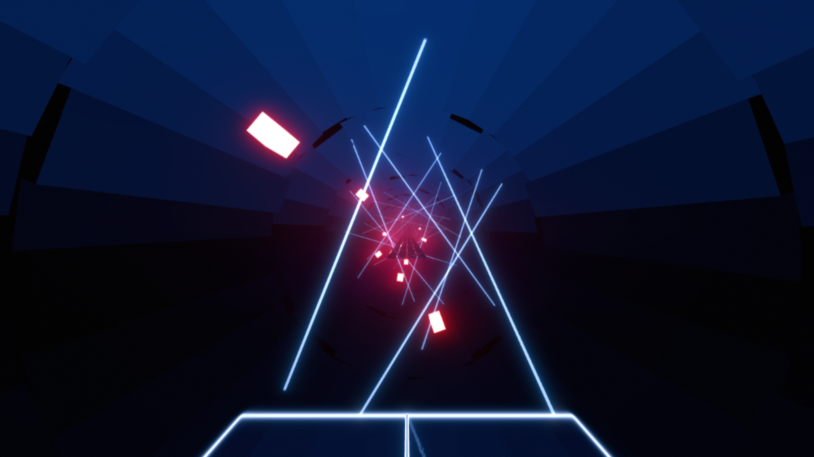

Used in:  
https://beatsaver.com/maps/40fa7 

Summery:  
A huge tube with lasers all around and cubes moving around the tube.

How to install:  
Go into the info.dat file and find where is says: ("_environmentName":) and make that say: ("_environmentName": "DragonsEnvironment",)  
Go download the script here: https://github.com/MadChase/ChromaPlus-Importer/tree/main  
Follow all the steps in the Guthub page and download the script from releases  
Put the eveything in One folder (env.dat, ExpertPlusStandard.dat, and ChromaPlus-Importer-1.0.0.py) and run the script via VSCode     

How to Use:  
If you plan on using cm for chroma ids i HIGHLY suggest getting the ExtendedLightIDs plugin found here: https://github.com/MoistSac/ChroMapper-ExtendedLightIDs which allows you to see the added light ids using alt+p.   
Things on Back Laser: all the lasers are on here with lightids - 101-154   
Things on Left Rotating Lasers: The cubes are on here with lightids - 101-115   
Things on Left Center Lights: All the fill lights are on here with lightids - 1000-1129   
Tracks: You can mess with them though they should be working as intended. Too many to list so just look in you .dat file if you want to mess with them   

