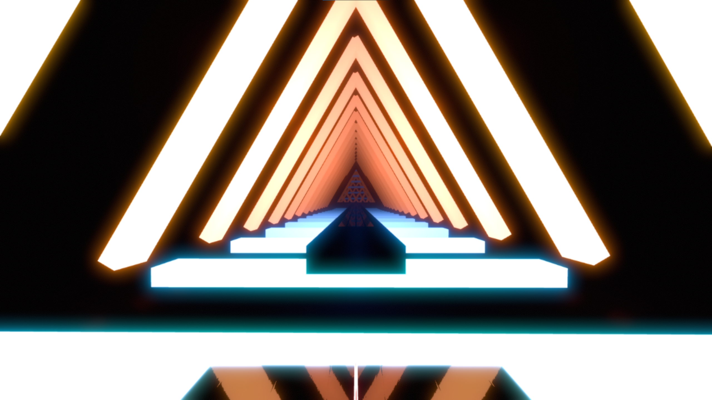

## Used in:  
https://beatsaver.com/maps/4391e

## Summery:  
Big moving triangle that keeps going forever

## How to install:  
Main (suggeted):    
Go into the info.dat file and find where is says: ("_environmentName":) and make that say: ("_environmentName": "KDAEnvironment",)  
Go download the script here: https://github.com/MadChase/ChromaPlus-Importer/tree/main  
Follow all the steps in the Github page and download the script from releases  
Put the everything in One folder (env.dat, ExpertPlusStandard.dat, and ChromaPlus-Importer-1.0.0.py) and run the script via VSCode   
Go int Chromapper and save the diff and then you should be good to go.
NOTE - This env specific NEEDS Noodle to work (ie, needs both chroma and noodle in the map)   

Alternate:    
This is for people who want to do it without the chorma importer (still needs VSCode).    
Open up the diffyour diff in VSCode and search for the word "customData" using ctrl+f.   
(If missing or having multiple go into Chromapper and click the pickaxe tool, then type something into the blank space. then ctrl+f for whatever you typed in and use the "customData" that that was in)    
Copy all text in the "customData" of the env.dat file into the diff's "customData" and you should then be good to go with using it in cm.    
NOTE - make sure to switch the env to the one listed in the main steps

## How to Use:  
If you plan on using cm for chroma ids i HIGHLY suggest getting the ExtendedLightIDs plugin found here: https://github.com/MoistSac/ChroMapper-ExtendedLightIDs which allows you to see the added light ids using alt+p.   
Everything is on Big Rings: all the moving lights are on lightid 101-364. The order of these light ids is wierd so here is what i know, Light ids 346,142-179, and 101-125 are on the bottom and the rest are on the top two.  
Tracks: You can mess with them though they should be working as intended. Too many to list so just look in your .dat file if you want to mess with them   

